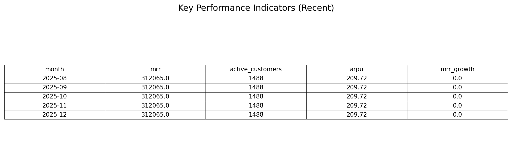

# Project Summary: SaaS Customer Journey Analytics

**Objective**: To build a robust, reproducible data pipeline for a B2B SaaS product, transforming raw user logs into actionable business intelligence (MRR, Churn, LTV, Retention).

## Key Deliverables
1. **Automated Pipeline**: Python scripts (`/scripts/`) that ingest raw CSVs and output clean KPI tables.
2. **Tableau Integration**: Dedicated extracts (`/outputs/tableau_ready/`) formatted for BI tools.
3. **LTV Simulator**: An Excel model (`P5_LTV_Simulator.xlsx`) allowing scenario planning for pricing and churn reduction.

## Key Metrics Computed
- **Monthly Recurring Revenue (MRR)**: Tracked by New, Expansion, and Churn segments.
- **Cohort Retention**: A matrix view of user retention over time.
- **Customer Lifetime Value (LTV)**: Projected value based on ARPU and Churn rates.
- **Activation Rate**: Conversion from signup to 'campaign_create'.

## Visuals
*(Place your screenshots here in /docs/screenshots/)*
- **Excel Simulator**:
  
- **KPI Summary**:
  
